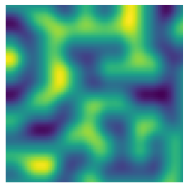
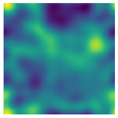

Unhacked version:

Hacked version:

Animated:

This is a hack-y version of the perlin noise algorithm.  There's no hash
function, we calculate random normalized vectors on-the-fly instead. These
random vectors should at least reduce directional artifacts -- we do suffer
extra computational overhead. We interpolate with nd.gaussian_filter, which is
an interpolation through convolution.

The goal is simply to see if I could mimick perlin noise with an image filter.